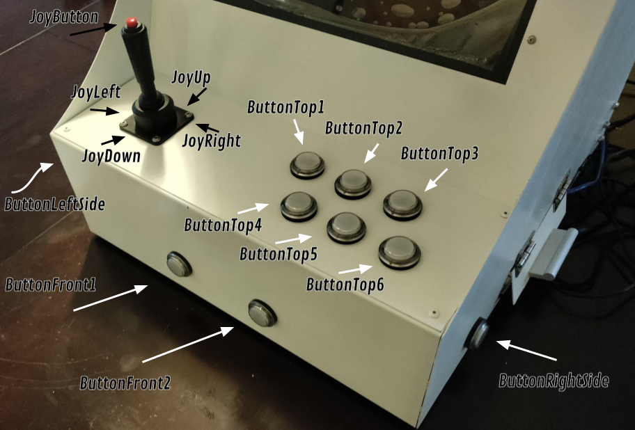
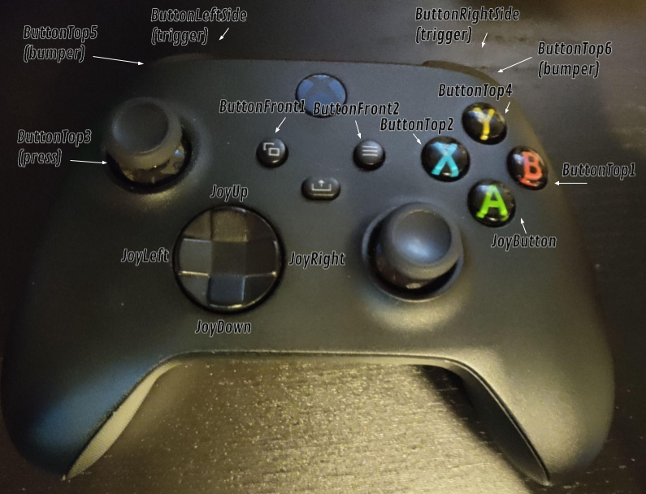

# bevy-rust-arcade

A plugin for the [Bevy Engine](https://bevyengine.org/) that allows you to easily make your games compatible with Rust Arcade Machine. Learn more about the Rust Arcade project [here](https://twitter.com/carlosupina/status/1523715837726961664).


This plugin wraps the relevent Bevy gamepad events in more descriptive names specific to the arcade cabinet, according to the image below.



You can test these inputs without accessing the arcade machine by using an xbox controller, they are mapped accordingly to the buttons below.



Below is some simple code from the input example to get you started.

```rust
use bevy::prelude::*;
use bevy_rust_arcade::{ArcadeInputEvent, RustArcadePlugin};

fn main() {
    App::new()
        .add_plugins(DefaultPlugins)
        .add_plugin(RustArcadePlugin)
        .add_system(arcade_event_system)
        .run();
}

// Read arcade input events
fn arcade_event_system(mut arcade_input_events: EventReader<ArcadeInputEvent>) {
    for event in arcade_input_events.iter() {
        info!(
            "{:?} of {:?} is changed to {}",
            event.arcade_input, event.gamepad, event.value
        );
    }
}

```

